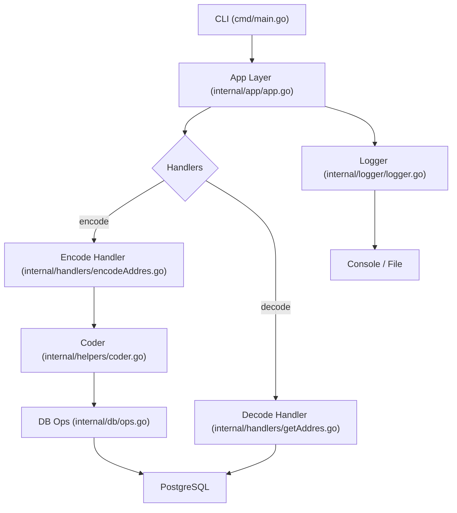

# Shortify – Утилита для сокращения ссылок

## Описание

`Shortify` – небольшой проект, позволяющий преобразовывать длинные URL‑адреса в короткие ссылки. Проект создан в учебных целях и демонстрирует навыки работы с Go, Docker, базой данных и логированием, экспериментов с нагрузкой.

## Текущее состояние

> **Важно:** проект находится в стадии разработки и **ещё не завершён**. Он используется для практики и демонстрации навыков разработки

## Основные компоненты

- [`cmd/main.go`](cmd/main.go:1) – точка входа, парсит аргументы командной строки и инициирует обработку запросов.
- [`internal/app/app.go`](internal/app/app.go:1) – основной слой приложения, координирует работу сервисов.
- [`internal/config/config.go`](internal/config/config.go:1) – загрузка конфигурации из `.env`.
- [`internal/handlers/encodeAddres.go`](internal/handlers/encodeAddres.go:1) – обработчик создания короткой ссылки.
- [`internal/handlers/getAddres.go`](internal/handlers/getAddres.go:1) – обработчик получения оригинального URL по короткой ссылке.
- [`internal/helpers/coder.go`](internal/helpers/coder.go:1) – логика кодирования/декодирования идентификаторов.
- [`internal/db/connection.go`](internal/db/connection.go:1) и [`internal/db/ops.go`](internal/db/ops.go:1) – работа с PostgreSQL.
- [`internal/logger/logger.go`](internal/logger/logger.go:1) – централизованное логирование.

## Схема работы

